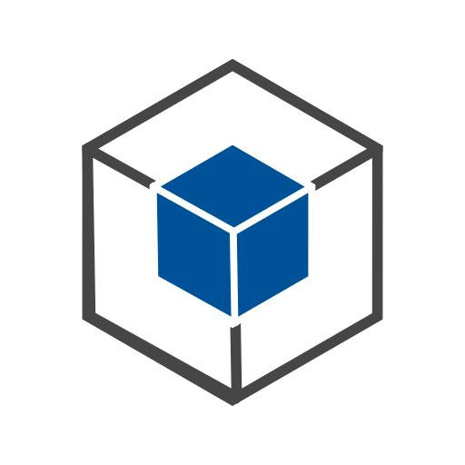
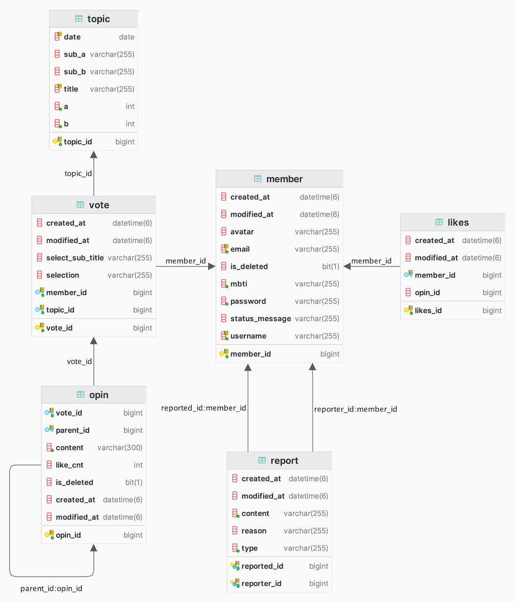

---
## 🎬 서비스 소개
> 소셜 네트워크 서비스(SNS)는 뉴스, 엔터테인먼트, 정치, 기술 등 다양한 주제에 관한 정보가 빠르게 공유되고 확산하는 현대의 중심입니다. 
> 하지만 다양한 정보 소스 중에서도 특정 사이트나 플랫폼은 종종 편향된 의견에 치우치며 여론에 부정적인 영향을 미칠 수 있습니다.
> 이에 대한 방안으로 우리는 다양한 시각과 의견을 모으고 토론을 통해 하나의 결론에 도달하기 위해 토론 플랫폼 서비스를 개발했습니다.
> 서비스의 목표는 민주적인 토론을 촉진하고, 토론의 교육적인 가치를 강조하며, 다양한 시각을 수용할 수 있는, 특정 연령대를 위하지 않는 공동의 토론 플랫폼으로 발전하는 것입니다.

 

---
## 👨‍👨‍👧 팀원 소개

<table>
  <tbody>
    <tr>
        <td style="text-align: center"> 프론트 </td>
        <td style="text-align: center"> 백엔드 </td>
        <td style="text-align: center"> 백엔드 </td>
    </tr>
    <tr>
     <td>  </td>
     <td>  </td>
     <td>  </td>
   </tr>
    <tr>
      <td style="text-align: center"><a href="https://github.com/hyunyeee"> 오현의 </a></td>
      <td style="text-align: center"><a href="https://github.com/thingk0"> 고명성 </a></td>
      <td style="text-align: center"><a href="https://github.com/dlrjs2360"> 이희건 </a></td>
    </tr>
  </tbody>
</table>

 

---
## 📚 기술 스택

<table>
  <tr>
    <th>항목</th>
    <th>내용</th>
  </tr>
  <tr>
    <td>언어</td>
    <td>
      
      
    </td>
  </tr>
  <tr>
    <td>프레임워크</td>
    <td>
      
      
      
    </td>
  </tr>
  <tr>
    <td>라이브러리</td>
    <td>
      
    </td>
  </tr>
  <tr>
    <td>데이터베이스</td>
    <td>
      
      
      
    </td>
  </tr>
  <tr>
    <td>도구</td>
    <td>
      
      
      
      
</td>
  </tr>
  <tr>
    <td>배포</td>
    <td>
      
      
      
      
      
      
    </td>
  </tr>
</table>

 

---
## 📑 기능명세서
<table>
  <tr>
    <th>분류</th>
    <th>기능 목록</th>
  </tr>
  <tr>
    <td>USER</td>
    <td>
        회원가입, 로그인, 로그아웃, 회원정보 수정, 회원탈퇴, 회원정보 조회
    </td>
  </tr>
  <tr>
    <td>TOPIC
</td>
    <td>
        주제 조회, 주제 검색
    </td>
  </tr>
  <tr>
    <td>COMMENT</td>
    <td>
        댓글 조회, 댓글 작성, 댓글 수정, 댓글 삭제, 댓글 신고, 댓글 좋아요, 대댓글 작성
    </td>
  </tr>
  <tr>
    <td>VOTE</td>
    <td>
        투표, 투표 통계 조회
    </td>
  </tr>
</table>

 

---
## ⁉️ 개발 이슈와 고민사항

### 1️⃣ <u>Redis 캐싱 전략</u>
> 토론 플랫폼에서 사용자가 가장 자주 사용하는 데이터를 고르자면 댓글입니다. “하우바츄”에서는 메인페이지에서 토론이 진행되기 때문에 어떤 데이터보다도 자주 읽히고 자주 쓰일 것입니다. “결과의 약 80%는 20%의 원인에서 비롯된다” 라는 파레토 법칙이 가장 잘 적용될 케이스라는 생각을 하게 되었고 캐싱을 통해 서비스의 성능을 향상하기로 하였습니다.
>
> 캐싱은 Redis 를 이용했습니다. 인메모리 기반 데이터베이스 중 가장 대중적이면서 레퍼런스가 많았고 장애 발생 대처 방안 또한 자체적으로 제공해주는 솔루션이 있었기 때문입니다. 캐싱 전략으로는 Write Back 전략과 Read Through 전략을 결합했습니다. 최신의 데이터는 캐시에만 저장하고 주기적인 데이터베이스 업데이트를 실시하며 사용자는 캐시에서만 데이터를 읽어 항상 최신의 데이터를 읽을 수 있다는 장점을 얻을 수 있었기 때문입니다.
>
> 하지만 캐싱을 진행하는 과정에서 리스트를 캐싱하는 과정에서 많은 어려움이 있었습니다. 단일 객체나 자료형에 대한 캐싱은 많은 레퍼런스가 존재했지만 리스트에 대한 캐싱은 찾아보기 어려웠습니다. 캐싱된 리스트 안의 댓글 일부가 수정될 때마다 항상 해당 캐시를 지우고 다시 캐시를 저장해야하는 문제가 있었습니다.
> 
> 이에 대한 방법으로 캐시에 단일 댓글들만 저장하고 서버 안에 캐싱된 댓글을의 ID를 리스트로 관리해보았습니다. 이 방법을 사용했을 때 수정과 갱신에는 용이했지만 MySQL 데이터베이스에서 JPA 기본 메서드로 데이터를 불러올 때보다 2배 가량 느린 속도를 보였습니다.
>
> 많은 고민과 여러 조언들을 바탕으로 댓글에 대한 캐싱 기능을 철회하게 되었습니다. 변동성이 큰 댓글 엔티티는 캐시에서 조회를 위한 삭제, 변경이 너무 자주 이루어지며 API의 성능을 오히려 해칠 수 있다는 판단을 하게 되었기 때문입니다.
### 2️⃣ <u>리프레쉬 토큰 탈취 시나리오 대응</u>
> 회원관리는 JWT를 이용해 인증인가를 구현했습니다. 그 안에서는 회원의 정보를 가지고 직접적인 인증 인가를 처리하는 Access Token 과 이 토큰의 재발급을 위해 존재하는 Refresh Token 을 사용했습니다. 일반적으로 Access Token은 인증 인가에 직접적으로 사용되기 때문에 탈취 위험성을 고려해 30분 정도의 짧은 유효기간을 설정하고 Refresh Token은 2주 정도의 긴 유효기간을 설정합니다.
>
> 이 인증인가 과정에서 저는 “만약 Refesh Token이 탈취당한다면 어떻게 할까?” 라는 의문을 가지게 되었습니다. 공격자가 긴 유효기간을 가지는 Refresh Token 탈취에 성공한다면 지속적인 Access Token 발급을 통해서 서비스에 큰 위협이 될 것이라고 생각했습니다. 따라서 이에 대한 대응방안으로 Refresh Token Rotate 라는 기법을 도입했습니다.
>
> Refresh Token Rotate 기법은 리프레쉬 토큰을 일회용으로 생성하여 공격자가 탈취하더라도 사용자의 로그인을 통해 공격의 지속성을 줄일 수 있습니다. 리프레쉬 토큰을 사용할 떄마다 새로운 리프레쉬 토큰을 발급하고 DB에 저장함으로써 토큰을 사용한 사용자가 가진 리프레쉬 토큰과 비교하고 이 비교가 불일치가 된다면 탈취당한 것으로 판단합니다. 이런 방식으로 공격자는 탈취한 리프레쉬 토큰을 사용할 수 없고 Access Token이 만료되면 공격을 이어갈 수 없다는 해결방안을 적용할 수 있었습니다.

 

---
## 🏛️ 서비스 아키텍쳐

 

---
## 🧬 ER 다이어그램

 
